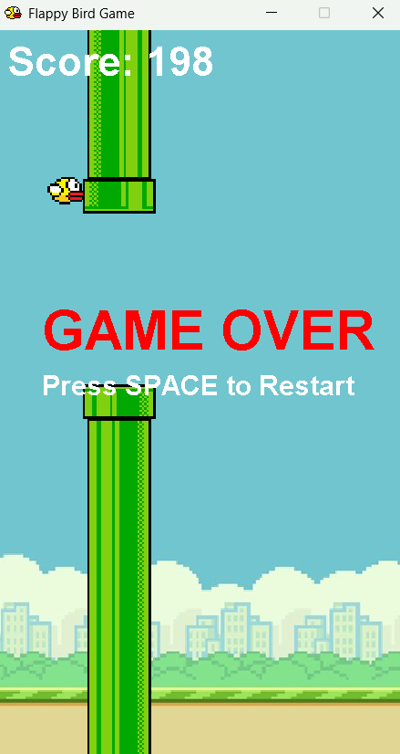

# 🚀 Flappy Bird Java Edition — v1.0 Release

Welcome to the first official release of Flappy Bird Java Edition —  
a smooth, faithful remake of the classic Flappy Bird game,  
fully written in Java Swing, and bundled as a self-contained runnable JAR!

## 🎮 How to Play

- Press the **SPACE** bar to make the bird flap and fly.  
- Avoid the green pipes — collision ends the game immediately.  
- Your score increases with each pipe you successfully pass.  
- Press **SPACE** after *Game Over* to restart and keep flying!

## 💻 How to Run

This release includes a self-contained executable JAR file, no extra setup or installation needed:

```bash
java -jar FlappyBirdGame.jar
```
Requires Java 8 or newer installed on your system.  
Alternatively, simply double-click the JAR file to launch (depends on your OS Java setup).

## 📦 What’s Included

- 🎨 Full graphical game assets packed inside the JAR — no external files  
- ⚙️ Classic gameplay loop with scoring, restart, and simple controls  
- 🐦 Responsive bird physics, pipe generation & collision detection  
- 🔄 Instant restart upon game over without relaunching  
- 🧰 Source code available in the repository for learning or modification
## 🎮 Gameplay Preview


## 💡 Developers & Contributors

The full Java source is available on the repo:  
[https://github.com/madashivakarthikgoud/flappyBird](https://github.com/madashivakarthikgoud/flappyBird)

Contributions are welcome! Fork and submit Pull Requests or raise Issues.  
Feel free to customize, extend, or port the game!

## 🔗 Download

⬇️ Download Assets:
[FlappyBird v1.0](https://github.com/madashivakarthikgoud/flappyBird/releases/tag/v1.0)
**FlappyBirdGame.jar** — Ready-to-run self-contained Java game

⭐ Thanks for trying Flappy Bird Java Edition!  
If you enjoy it, please leave a star on the repo and share your high scores!

